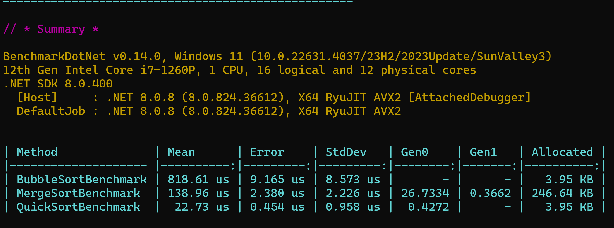

# Project Demonstration: Sorting Algorithms Efficiency

This project was developed to demonstrate the efficiency of three popular sorting algorithms: **BubbleSort**, **MergeSort**, and **QuickSort**. It includes a performance comparison between these algorithms using the **BenchmarkDotNet** library.

## Introduction to Big O

Big O is a mathematical notation used to describe the performance of algorithms, particularly in terms of time complexity and space complexity as the size of the input grows. Each algorithm in this project exhibits different performance behavior based on its specific implementation.

For a more detailed introduction to Big O, check out [this guide](https://www.bigocheatsheet.com/).

## Sorting Algorithms

### BubbleSort

**BubbleSort** is one of the simplest sorting algorithms. It repeatedly steps through the list, compares adjacent elements, and swaps them if they are in the wrong order. This process is repeated until the list is sorted.

- **Best-case performance**: O(n) — occurs when the array is already sorted.
- **Average-case performance**: O(n²) — involves multiple comparisons and swaps.
- **Worst-case performance**: O(n²) — occurs when the array is sorted in reverse order.
- **Space complexity**: O(1) — since it is an in-place sorting algorithm, it requires only a constant amount of additional memory.

### MergeSort

**MergeSort** is a divide-and-conquer algorithm that divides the unsorted list into sublists until each sublist contains a single element. Then, it merges the sublists to produce a sorted list.

- **Best-case performance**: O(n log n) — consistent across all cases since the algorithm always divides the list into halves.
- **Average-case performance**: O(n log n) — consistently efficient regardless of the initial order of elements.
- **Worst-case performance**: O(n log n) — due to the balanced splitting and merging processes.
- **Space complexity**: O(n) — requires additional space proportional to the size of the input list for the merging process.

### QuickSort

**QuickSort** is another divide-and-conquer algorithm. It selects a 'pivot' element and partitions the array into two halves, such that elements less than the pivot come before it, and elements greater come after it. The process is then recursively applied to the subarrays.

- **Best-case performance**: O(n log n) — occurs when the pivot divides the array into two nearly equal parts.
- **Average-case performance**: O(n log n) — generally efficient due to average case behavior.
- **Worst-case performance**: O(n²) — occurs when the smallest or largest element is always chosen as the pivot, leading to unbalanced partitions.
- **Space complexity**: O(log n) — for the recursive call stack in the best case, though it can be O(n) in the worst case depending on the implementation.

## Benchmark Results

Below is a visual representation of the benchmark results for the sorting algorithms:

## Libraries Used

### BenchmarkDotNet

**BenchmarkDotNet** is a powerful library for measuring the performance of .NET code. It is used for benchmarking methods, helping to identify performance bottlenecks and compare the efficiency of different implementations.

#### Basic Usage:
To use BenchmarkDotNet, you can decorate benchmark methods with `[Benchmark]` and then run the benchmark in a class that inherits from `BenchmarkBase`. Here’s a basic example:

\`\`\`csharp
[Benchmark]
public void BubbleSortBenchmark()
{
    var data = GenerateRandomArray();
    new BubbleSort().Sort(data);
}
\`\`\`

For more details, refer to the [official BenchmarkDotNet documentation](https://benchmarkdotnet.org/articles/overview.html).

### Bogus

**Bogus** is a library for generating fake data in .NET. It's useful for testing and quickly populating datasets with realistic, yet random, values.

#### Basic Usage:
You can create custom data generators for various entities. Here’s an example of generating a list of random numbers:

\`\`\`csharp
var faker = new Faker<int>()
    .CustomInstantiator(f => f.Random.Int(0, 1000));

var randomNumbers = faker.Generate(100);
\`\`\`

For more details, refer to the [official Bogus documentation](https://github.com/bchavez/Bogus).

## Contributing

We welcome contributions to enhance the capabilities of the project. Please submit your pull requests, and feel free to open issues for any bugs or feature requests.

## License

This project is licensed under the MIT License. See the LICENSE file for details.

## Keywords

`#SortingAlgorithms`, `#Benchmarking`, `#BubbleSort`, `#MergeSort`, `#QuickSort`, `#BenchmarkDotNet`, `#Bogus`, `#DotNet`, `#CSharp`

## Connect with Me

Let's connect on LinkedIn:

[Anderson Meneses on LinkedIn](https://www.linkedin.com/in/anderson-meneses)
